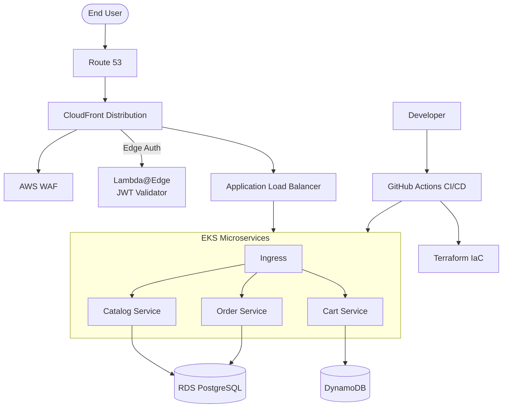
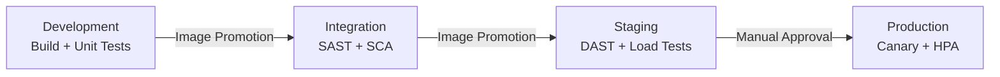

# B2C Merchant Solution Infrastructure

Welcome to the infrastructure repository for the modern B2C Merchant Solution. This repository defines the foundational architecture, deployment pipelines, and security guardrails necessary to run a highly available, secure, and globally distributed e-commerce platform.

## Architecture Overview

The solution leverages AWS for its robust infrastructure, focusing on edge-optimized delivery, secure microservices, and automated governance.

### High-Level Components

*   **Edge Delivery & Security**: Amazon CloudFront, AWS WAF, and Lambda@Edge provide fast content delivery, edge authentication (JWT verification), and protection against web exploits and DDoS attacks.
*   **Routing**: Amazon Route 53 handles DNS and global routing.
*   **Compute (Core Services)**: Amazon Elastic Kubernetes Service (EKS) hosts the core microservices. We utilize an Application Load Balancer (ALB) as the ingress controller.
*   **Data Tier**: Amazon RDS (for transactional relational data) and Amazon DynamoDB (for high-scale, schema-flexible data like user sessions or product carts).
*   **CI/CD**: GitHub Actions drives automated testing, security scanning, and deployments.
*   **Governance**: Infrastructure as Code (Terraform) heavily utilizes Open Policy Agent (OPA) for configuration checks, augmented by AWS Config and Service Control Policies (SCPs).

### Architecture Diagram



## Repository Structure

```
.
├── .agents/
│   ├── skills/merchant-guidelines/  # AI agent rules for this repo
│   └── workflows/                   # Deployment workflow definitions
├── .github/
│   └── workflows/                   # GitHub Actions CI/CD pipelines (.example)
├── docs/
│   ├── architecture/                # System design and data flow
│   ├── ci_cd/                       # Deployment strategies and rollouts
│   ├── infrastructure/              # SOC 2, guardrails, compliance
│   └── observability/               # DORA metrics and Datadog dashboards
├── infra/
│   ├── policies/                    # OPA/Rego guardrail policies
│   └── terraform/
│       ├── 01-core-eks/             # EKS cluster, node groups, IRSA
│       ├── 02-routing-security/     # CloudFront, WAF, Lambda@Edge
│       ├── 03-observability/        # Datadog, Coralogix, Firehose
│       └── environments/            # Per-env tfvars (dev/int/stg/prod)
├── merchant-core-api-chart/
│   ├── templates/                   # Helm K8s manifests
│   ├── environments/                # Per-env values (dev/int/stg/prod)
│   └── values.yaml                  # Base chart values
├── scripts/
│   └── emit-dora-metrics.sh         # DORA metrics emission (Datadog + Coralogix)
└── src/
    └── edge-auth/                   # Lambda@Edge JWT validator
```

## CI/CD Pipeline

Each environment has a dedicated GitHub Actions workflow (`.example` files). Image is built **once** in development and promoted immutably through all stages.



| Stage | Build | Security | Testing | Deploy | DORA Tracked |
|-------|-------|----------|---------|--------|-------------|
| **Development** | ✅ Docker build + ECR push | — | Unit tests, Linting | Helm + CPU HPA | Errors, Lead Time |
| **Integration** | ❌ Promote only | SAST, SCA (Trivy) | Regression + Progression | Helm + CPU HPA | Security Rejects |
| **Staging** | ❌ Promote only | DAST (ZAP) | Regression + Progression + Load | Helm + CPU HPA | Security Rejects |
| **Production** | ❌ Promote only | Container scan | Post-deploy Regression (Canary) | Helm + **Datadog Latency HPA** | Deploy Freq, Lead Time |

## High Availability

*   **Multi-AZ EKS**: Cluster and node groups span 3+ Availability Zones
*   **Pod Anti-Affinity**: Pods distributed across AZs (weight 100) and nodes (weight 50)
*   **Autoscaling**: CPU-based HPA in lower envs; Datadog p99 latency HPA in production (3→20 replicas)

## Security & Governance

*   **Zero Console Access**: SCPs block all human write operations to staging/production
*   **Automated Deployments Only**: All mutations via GitHub Actions CI/CD role
*   **OPA Guardrails**: Mandatory tagging, no public SSH, no unplanned deletions
*   **Terraform Safety**: `plan` → deletion check → manual approval → `apply`
*   **Secrets**: All API keys fetched from AWS Secrets Manager at runtime

## DORA Metrics

Deployment lifecycle data is dual-shipped to **Datadog** (custom metrics) and **Coralogix** (structured logs via Kinesis Firehose).

| Metric | Description |
|--------|-------------|
| Deployment Frequency | Deploys per day across all environments |
| Lead Time for Changes | Seconds from first commit to production deploy |
| Change Failure Rate | Failed deploys / total deploys (%) |
| Development Error Count | Unit test and lint failures in dev |
| Security Rejection Count | SAST/SCA/DAST scan failures blocking promotion |

Import the pre-built dashboard: [`datadog-dora-dashboard.json`](docs/observability/datadog-dora-dashboard.json)

## Getting Started

Refer to the documentation for deep dives into specific areas:

*   [Flow of Operations](docs/architecture/flow_of_operations.md)
*   [Infrastructure Guardrails & SOC 2](docs/infrastructure/guardrails_and_soc2.md)
*   [GitHub Actions & Rollouts](docs/ci_cd/github_actions_rollouts.md)
*   [DORA Metrics Architecture](docs/observability/dora_metrics.md)
