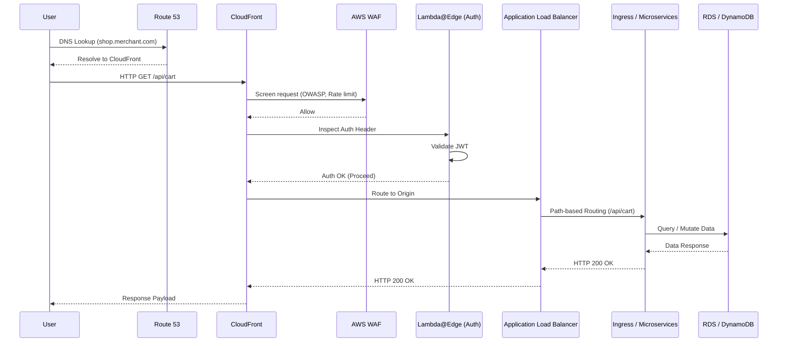

# Flow of Operations

This document outlines the lifecycle of a request flowing through the B2C Merchant Solution infrastructure. We follow a defense-in-depth approach, ensuring validation and optimization at every layer.

## The Request Lifecycle

### 1. DNS Resolution (Amazon Route 53)
When a customer attempts to access the merchant storefront (e.g., `shop.merchant.com`), Amazon Route 53 resolves the DNS query. We utilize alias records pointing to our global CloudFront distribution.

### 2. Edge Delivery & Security (Amazon CloudFront + AWS WAF)
*   The request arrives at the nearest AWS Edge location via Amazon CloudFront.
*   **Caching**: Static assets (images, CSS, JS) are served directly from the edge cache, significantly reducing latency and backend load.
*   **WAF (Web Application Firewall)**: Dynamic API requests immediately pass through AWS WAF. Rules here block common exploits (OWASP Top 10), enforce rate limiting to prevent abuse, and filter traffic based on geographic or IP reputation criteria.

### 3. Edge Authentication (Lambda@Edge)
Before dynamic requests are allowed to proceed to the backend, we validate authentication at the edge.
*   **Lambda@Edge (Viewer Request/Origin Request)**: A Lambda function intercepts the request and inspects the `Authorization` header.
*   **JWT Validation**: The function validates the JSON Web Token (JWT) against the Identity Provider's (e.g., Amazon Cognito, Auth0) public keys.
*   If valid, the request proceeds. If invalid, a 401 Unauthorized is returned directly from the edge, protecting the EKS backend.

### 4. Ingress (Application Load Balancer)
Authorized requests are routed by CloudFront securely to an Application Load Balancer (ALB) deployed within the AWS region.
*   The ALB terminates TLS (if not already handled by CloudFront to the origin) and routes requests to the EKS cluster based on path or host headers (e.g., `/api/cart/*` goes to the Cart Service).

### 5. Core Microservices (Amazon EKS)
*   **AWS ALB Ingress Controller**: Manages the routing rules within the cluster, ensuring traffic reaches the correct Kubernetes Service.
*   **Microservices**: Services like the Catalog, Cart, and Order APIs process the business logic. These are deployed as containerized pods managed by Deployments.
*   **Scaling**: Kubernetes Horizontal Pod Autoscalers (HPA) scale the number of pods based on CPU/Memory usage or custom metrics, while the Cluster Autoscaler provisions new EC2 nodes or Fargate profiles if the cluster needs more capacity.

### 6. Data Tier (RDS / DynamoDB)
Microservices persist state to Purpose-Built Databases:
*   **DynamoDB**: Used for high-throughput, low-latency requirements without complex relations (e.g., the shopping cart, active user sessions).
*   **RDS (PostgreSQL)**: Used for transactional data requiring ACID compliance and complex queries (e.g., product catalog, order history, inventory).

## Operational Sequence Diagram

