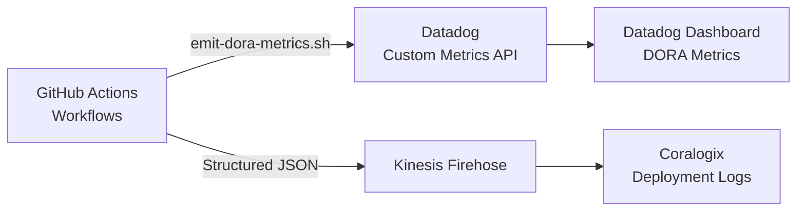

# DORA Metrics Architecture

This document describes how the B2C Merchant platform implements and tracks the **DORA (DevOps Research and Assessment)** Four Key Metrics, enhanced with custom security and development quality indicators.

## Metrics Tracked

| Metric | DORA Category | Source | Visualization |
|--------|--------------|--------|---------------|
| **Deployment Frequency** | Core | All environment workflows emit `dora.deployment.frequency` on each successful deploy | Datadog timeseries (bars, grouped by env) |
| **Lead Time for Changes** | Core | Calculated as seconds between first commit and production deploy timestamp | Datadog timeseries (line, production only) |
| **Change Failure Rate** | Core | Ratio of `dora.change_failure.count` to `dora.deployment.frequency` | Datadog query value widget (percentage) |
| **Development Error Count** | Extended | Incremented when unit tests or linting fails in the development pipeline | Datadog timeseries (warm palette) |
| **Security Rejection Count** | Extended | Incremented when SAST/SCA (integration) or DAST (staging) scans block promotion | Datadog timeseries (red palette) |

## Architecture

## How It Works

1. **Every workflow** (development, integration, staging, production) ends with a `DORA Metrics` step.
2. The step calls `scripts/emit-dora-metrics.sh` with environment variables specifying the event type, commit SHA, and computed metrics.
3. The script sends custom metrics to Datadog via the `/api/v1/series` endpoint and creates a deployment event via `/api/v1/events`.
4. Simultaneously, the script pushes a structured JSON log record to the environment's Kinesis Firehose delivery stream, which delivers it to Coralogix for long-term log retention and auditing.

## Dashboard

Import the pre-built dashboard from `docs/observability/datadog-dora-dashboard.json` into your Datadog organization via the Dashboard API or the UI import feature.

## Event Types

| Event Type | When Emitted |
|-----------|-------------|
| `deploy_started` | Pipeline begins deployment (optional) |
| `deploy_succeeded` | Deployment completes successfully |
| `deploy_failed` | Deployment fails (increments change failure rate) |
| `test_failed` | Unit/integration tests fail |
| `security_rejected` | SAST, SCA, or DAST scan blocks the pipeline |
| `rollback` | A production rollback is triggered |
